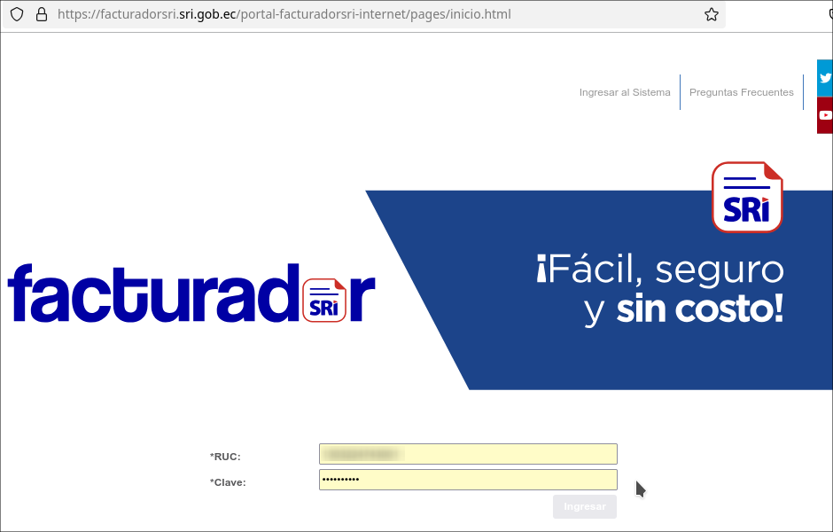
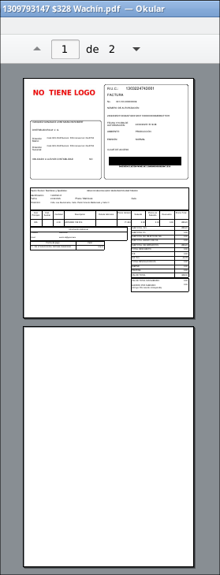
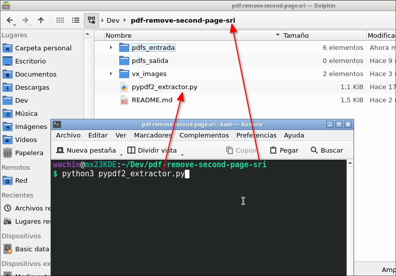

# pdf-remove-second-page-sri
Script en Python para eliminar la segunda página de archivos PDF de facturas del SRI:

[https://facturadorsri.sri.gob.ec/portal-facturadorsri-internet/pages/inicio.html](https://facturadorsri.sri.gob.ec/portal-facturadorsri-internet/pages/inicio.html)



cuando descargo los pdf del facturador del sri me aparecen dos hojas y la segunda no la necesito:



y no voy a estar quitandole a cada pdf con pdfsam, sino que este script me ayuda a hacer eso

# Tutorial: Eliminar la segunda página de archivos PDF en Debian 12

Este script en Python permite eliminar la segunda página de cada archivo PDF en una carpeta. Está diseñado para ejecutarse en Debian 12 y otras distribuciones basadas en Linux.

## Instalación de dependencias

Antes de ejecutar el script, es necesario instalar la biblioteca `PyPDF2`. En Debian 12, puedes instalarla desde los repositorios oficiales con el siguiente comando:

```bash
sudo apt update
sudo apt install python3-pypdf2 python3
```

## Clonación del repositorio

Para usar este script, primero clona el repositorio de GitHub donde lo hayas publicado:

```bash
git clone https://github.com/wachin/pdf-remove-second-page-sri
cd pdf-remove-second-page-sri
```

## Uso del script

1. Está creada una carpeta llamada `pdfs_entrada`, coloca allí los archivos PDF que deseas procesar.
2. Ejecuta el script con:

```bash
python3 remove_second_page.py
```

3. Los archivos procesados se guardarán en la carpeta `pdfs_salida` sin la segunda página.



Dios les bendiga